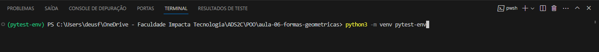
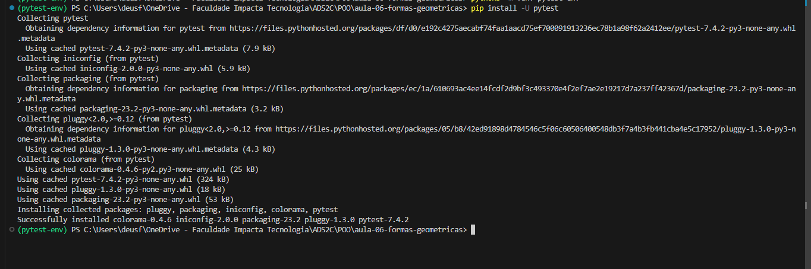
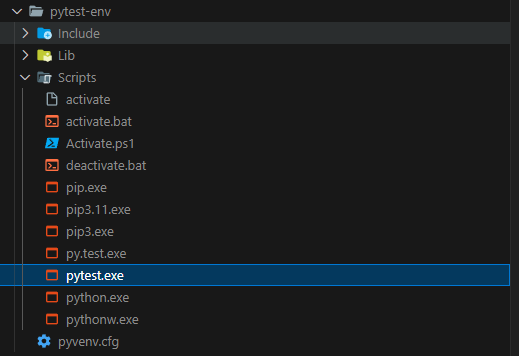
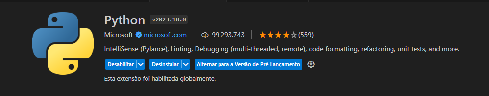
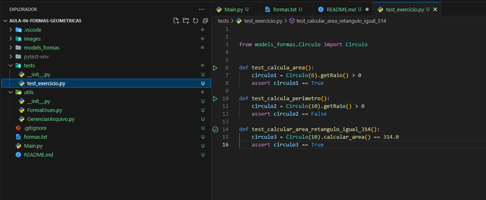
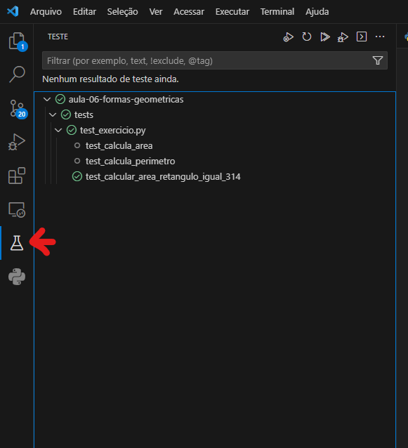
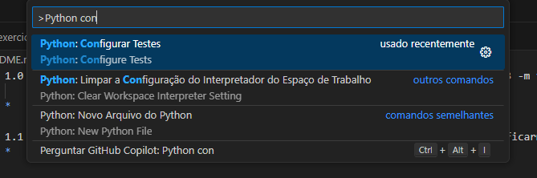
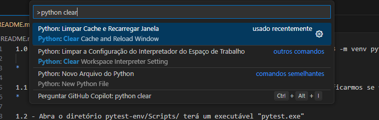

1.0 - Após abrir o projeto no vscode, abra o terminal e execute o comando "python3 -m venv pytest-env", ele irá criar
    uma variável de ambiente dentro do nosso projeto.
*   

1.1 - Instale o pacote do pytest com o comando "pip install -U pytest". para verificarmos se foi instalado dentro do nosso projeto.
*   

1.2 - Abra o diretório pytest-env/Scripts/ terá um executável "pytest.exe"
*   

2.0 - Verifique se você possui instalado a extênsão do Python no vscode, caso não, instale.
*   

3.0 - Abra o diretório tests, dentro dele tem nosso arquivo de teste "test_exercicio.py", com os métodos para testarmos
*   

3.1 - Na barra lateral terá a extensão de teste do python, clique nela para acessar nossos testes criados
*   

3.2 - Caso não mostre nenhum teste, você pode configurar manualmente os testes, abrindo a paleta de comandos do vscode
    "ctrl + shift + p". Em seguida digite "Python configure tests" e selecione a biblioteca de testes que no caso é o pytest,
    e selecione o diretório tests. O pytest vai procurar dentro do diretório tests pelos nossos arquivos "test_".
*   

3.3 - É possível que não carregue os testes como no passo 3.1, então podemos limpar o cache do vscode, fechando e abrindo novamente ou utilizando
    a paleta do vscode "ctrl + shift + p"  e digitando "Python clear cache"
*   

3.3.1 - Verifique se carregou os testes como na imagem do 3.1
